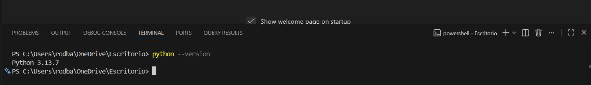

# 🐍 Clase 02 - Comentarios y función print()

# 1. Introducción a Python

<aside>

## Resumen

Python es un lenguaje de programación de **alto nivel**, **interpretable** y **fácil de leer**, ideal para principiantes y ampliamente usado en Inteligencia Artificial,  Ciencia de datos, Desarrollo Web, automatización y más..

</aside>

---

## 🚀 1.1 Introducción

### ¿Por qué Python?

Python es como el "cuchillo suizo" de los lenguajes de programación:

- **Sintaxis clara**: Se lee casi como inglés
- **Versatilidad**: Desde aplicaciones web hasta inteligencia artificial
- **Comunidad activa**: Millones de desarrolladores en todo el mundo
- **Demanda laboral**: Uno de los lenguajes más solicitados

### 🔧 Desarrollo Teórico

---

### ¿Qué es Python?

Python es un **lenguaje de programación interpretado**, lo que significa:

- No necesitas compilar el código antes de ejecutarlo
- Puedes probar código línea por línea
- Es perfecto para aprender y experimentar

> **Analogía**: Imagina que Python es como tener una conversación directa con la computadora, mientras que otros lenguajes requieren que escribas una carta completa antes de enviarla.
> 

## 💻 1.2 Práctica Guiada

### Actividad 1: Verificación de Instalación

### Verificar Python

Abre la terminal/línea de comandos y ejecuta (En visual Studio Code) :

```python
python --version
python3 --version  
```

**Salida esperada:**

```
Python 3.13.x
```



### Primera interacción con el intérprete

Escribe `python` (o python3 si usas linux) en la terminal:

```python
>>> print("¡Python está funcionando!")
>>> 2 + 3
>>> "Hola" + " " + "Mundo"
>>> exit()
```


### Actividad 2: Configuración de VS Code

### Paso 1: Crear tu primer archivo Python

1. Abre VS Code
2. Crea una nueva carpeta llamada `Clase_02`
3. Dentro de la carpeta, crea un archivo `primer_programa.py`

### Paso 2: Escribir el código

```python
# Mi primer programa en Python
print("¡Hola, mundo!")
print("Mi nombre es [TU_NOMBRE]")
print("¡Estoy aprendiendo Python!")
```

### Paso 3: Ejecutar el programa

- **Opción 1**: Botón "Run" (triángulo) en VS Code
- **Opción 2**: Terminal: `python primer_programa.py`

### Actividad 3: Explorando el Intérprete Interactivo

### Cálculos básicos

```python
>>> 15 + 25
40
>>> 100 / 4
25.0
>>> 2 ** 3  # Potenciación
8
>>> 17 % 5  # Módulo (resto)
2
```

### Actividad 4: Comentarios y Documentación

### Tipos de Comentarios

```python
# Esto es un comentario de una línea

"""
Esto es un comentario
de múltiples líneas
o docstring
"""

# Comentarios para explicar código complejo
edad = 25  # Edad del usuario en años
saludo = "¡Hola!"  # Mensaje de bienvenida

# Comentarios para dividir secciones
# ===== CÁLCULOS MATEMÁTICOS =====
resultado = (10 + 5) * 2

# ===== MOSTRAR RESULTADOS =====
print(f"El resultado es: {resultado}")

```

### Buenas Prácticas de Comentarios

```python
# ❌ Comentario innecesario
x = x + 1  # Incrementa x en 1

# ✅ Comentario útil
x = x + 1  # Contador de intentos de login

# ✅ Explicando lógica compleja
# Calculamos el descuento basado en la edad del cliente
# Menores de 18: 50% descuento
# Mayores de 65: 30% descuento
# Resto: sin descuento
pass
```

---

## 🎯 1.3 Ejercicios Básicos

### Ejercicio 1: Mi Presentación

> **Enunciado**: Crea un programa que imprima tu presentación personal incluyendo nombre, edad y ciudad.
> 

**Solución**:

```python
# Mi presentación personal
print("=== MI PRESENTACIÓN ===")
print("Nombre: Juan Pérez")
print("Edad: 25 años")
print("Ciudad: Madrid")
print("Pasatiempo: Aprender Python")
print("========================")
```

### Ejercicio 2: Calculadora Simple

> **Enunciado**: Usa el intérprete interactivo para resolver: (15 + 25) * 3 - 10
> 

**Solución**:

```python
# En el intérprete interactivo
>>> (15 + 25) * 3 - 10
110

# En un script - Utiliza Visal Studio Code
resultado = (15 + 25) * 3 - 10
print(f"El resultado de (15 + 25) * 3 - 10 = {resultado}")
```

### Ejercicio 3: Mensajes Personalizados

> **Enunciado**: Crea un programa que muestre 3 mensajes diferentes usando print().
> 

**Solución**:

```python
# Mensajes personalizados
print("🌟 ¡Bienvenido al curso de Python!")
print("📚 Cada día aprenderás algo nuevo")
print("🚀 ¡El límite es tu imaginación!")

```

---

<aside>
💡

# PRACTICA 02 - COMENTARIOS Y FUNCIÓN print()

# 🚀 1. Instrucciones de entrega

- Solo por esta vez, cada ejercicio debe entregarse por separado en archivos .py. Cada archivo debe estar identificado por su número de ejercicio, por ejemplo: el ejercicio 2.1 debe guardarse como `2.1.py` y así sucesivamente para los demás ejercicios.
- Entregar todos los ejercicios en una carpeta comprimida en .zip con tu nombre y apellido, por ejemplo: Si te llamas Antonio Pérez entonces el archivo final debe ser `AntonioPerez.zip`

# 🚀 2. Ejercicios Intermedios resueltos

<aside>
💡

**Estos ejercicios ya están resueltos, deberás modificarlos y adaptarlos a tu gusto.**

</aside>

### Ejercicio 2.1: Información del Sistema

> **Enunciado**: Crea un script que muestre información sobre tu instalación de Python usando comentarios explicativos.
> 

**Solución**:

```python
# Programa de información del sistema Python
# Este programa muestra detalles de la instalación

# Importamos el módulo sys para obtener información del sistema
import sys

# Mostramos la versión de Python
print("=== INFORMACIÓN DEL SISTEMA ===")
print(f"Versión de Python: {sys.version}")
print(f"Plataforma: {sys.platform}")

# Información adicional
print("\n=== DETALLES ADICIONALES ===")
print(f"Ruta del ejecutable: {sys.executable}")
print(f"Codificación por defecto: {sys.getdefaultencoding()}")

```

### Ejercicio 2.2: Calculadora de Propinas

> **Enunciado**: Crea un programa que calcule propinas del 10%, 15% y 20% para una cuenta de $50.
> 

**Solución**:

```python
# Calculadora de propinas para restaurante
# Calcula diferentes porcentajes de propina

# Configuración inicial
cuenta_total = 50.0  # Total de la cuenta en dólares

# Cálculo de propinas comunes
propina_10 = cuenta_total * 0.10  # 10% de propina
propina_15 = cuenta_total * 0.15  # 15% de propina (estándar)
propina_20 = cuenta_total * 0.20  # 20% de propina (buen servicio)

# Mostramos los resultados
print("=== CALCULADORA DE PROPINAS ===")
print(f"Cuenta total: ${cuenta_total:.2f}")
print(f"Propina 10%: ${propina_10:.2f} (Total: ${cuenta_total + propina_10:.2f})")
print(f"Propina 15%: ${propina_15:.2f} (Total: ${cuenta_total + propina_15:.2f})")
print(f"Propina 20%: ${propina_20:.2f} (Total: ${cuenta_total + propina_20:.2f})")

```

### Ejercicio 2.3: Generador de Mensajes

> **Enunciado**: Crea diferentes variaciones del mensaje "Hola mundo" usando operaciones con strings.
> 

**Solución**:

```python
# Generador de variaciones de "Hola Mundo"
# Demuestra diferentes formas de manipular strings

# Mensaje básico
mensaje_base = "Hola"
destinatario = "Mundo"

# Diferentes formas de mostrar el saludo
print("=== VARIACIONES DE SALUDO ===")
print(mensaje_base + " " + destinatario)  # Concatenación básica
print(f"{mensaje_base} {destinatario}!")  # F-string (recomendado)
print(mensaje_base, destinatario)  # Usando print con múltiples argumentos

# Variaciones creativas
print("\n=== VERSIONES CREATIVAS ===")
print(mensaje_base.upper() + " " + destinatario.lower())  # HOLA mundo
print((mensaje_base + " " + destinatario + "! ") * 3)  # Repetición
print(f"{'*' * 20}")  # Línea decorativa
print(f"*{mensaje_base:^18}*")  # Centrado con decoración
print(f"*{destinatario:^18}*")
print(f"{'*' * 20}")

```

### Ejercicio 2.4: “Script” de Bienvenida

> **Enunciado**: Crea un script que simule la bienvenida a una aplicación con información detallada.
> 

**Solución**:

```python
# Script de bienvenida a la aplicación
# Simula la pantalla inicial de un programa

# Información de la aplicación
nombre_app = "Python Learning Center"
version = "1.0.0"
autor = "Estudiante Python"

# Creamos una línea decorativa
linea_decorativa = "=" * 50

# Pantalla de bienvenida
print(linea_decorativa)
print(f"    🐍 {nombre_app.upper()} 🐍")
print(linea_decorativa)
print(f"Versión: {version}")
print(f"Desarrollado por: {autor}")
print(f"Lenguaje: Python {3.13}")  # Versión de Python
print()

# Mensaje de bienvenida personalizado
print("🌟 ¡Bienvenido a tu journey de aprendizaje! 🌟")
print()

# Instrucciones iniciales
print("📋 INSTRUCCIONES:")
print("   • Sigue las lecciones paso a paso")
print("   • Practica con los ejercicios")
print("   • No temas experimentar")
print("   • ¡Diviértete aprendiendo!")
print()

print(linea_decorativa)
print("         ¡Presiona ENTER para continuar!")
print(linea_decorativa)
```

---

# 🎪 3. Ejercicios Propuestos

### Ejercicio 3.1: Generador de Arte ASCII

> **Enunciado**: Crea un programa que genere un dibujo simple usando caracteres ASCII y comentarios explicativos.
> 

**Salida Esperada (solo de referencia, no tiene que ser igual)**:

```
=== GENERADOR DE ARTE ASCII ===

      🌟 MI PRIMERA CASA EN PYTHON 🌟

        🏠 Casa Simple 🏠

           /\
          /  \
         /____\
        |  🚪  |
        |   ⬜ |
        |______|

    Creado con: Python 3.11
    Caracteres usados: 45
    Líneas de código: 12

=== ¡Arte ASCII completado! ===

```

### Ejercicio 3.2: Generador de Patrones

> **Enunciado**: Crea un programa que genere 3 patrones diferentes usando repetición de caracteres y print().
> 

**Salida Esperada**:

```
=== GENERADOR DE PATRONES ===

🔸 Patrón 1: Escalera Ascendente
*
**
***
****
*****

🔸 Patrón 2: Pirámide Centrada
    *
   ***
  *****
 *******
*********

🔸 Patrón 3: Marco Decorativo
**********
*        *
*  HOLA  *
*        *
**********

¡Patrones generados exitosamente!

```

### Ejercicio 3.3: Dibujo en consola

> **Enunciado**: Usa `print()` para crear un dibujo simple (por ejemplo, una casa o un gato).
> 

**Salida Esperada**:

```jsx
 /\_/\
( o.o )
 > ^ <
```

### Ejercicio 3.4: Calculadora de Descuentos por Tipo de Cliente

> **Enunciado**: Crea un programa que calcule distintos **descuentos** sobre una compra de **$120.00** según el tipo de cliente:
> 
> - Cliente regular → 5% de descuento
> - Cliente frecuente → 10% de descuento
> - Cliente VIP → 20% de descuento
> 
> Muestra en pantalla el monto original, el descuento aplicado y el total a pagar para cada tipo de cliente.
> 

**Salida Esperada ( solo referencia visual )**

```
=== CALCULADORA DE DESCUENTOS ===
Monto original: $120.00
Cliente Regular (5%): Descuento $6.00 | Total: $114.00
Cliente Frecuente (10%): Descuento $12.00 | Total: $108.00
Cliente VIP (20%): Descuento $24.00 | Total: $96.00
```

</aside>