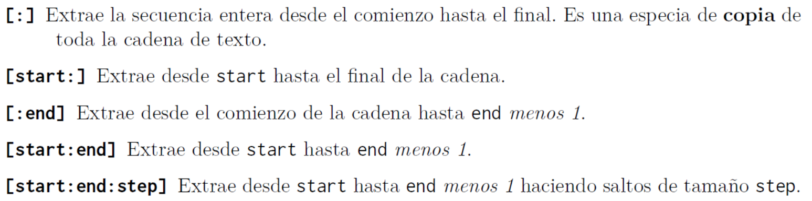

# 👨🏽‍💻Practica 06 - Operaciones con Strings y Condicional if

<aside>
💡

# Instrucciones

**Entregar los ejercicios en uno o varios `archivos.py` o en un notebook de Jupyter (`.ipynb`)**

</aside>

# Parte 1: Operaciones sobre Strings

## Ejercicio 1. Muestre el output del siguiente string:

```python
str = "Bienvenido a mi blog"
```

- a. print(str[3 : 18])
- b. print(str[2 : 14 : 2])
- c. print(str[ : 7])
- d. print(str[8 : -1 : 1])
- e. print(str[-9 : -15])
- f. print(str[0 : 9 : 3])
- g. print(str[9 : 29 : 2])
- h. print(str[-6 : -9 : -3])
- i. print(str[-9 : -9 : -1])
- j. print(str[8 : 25 : 3])

## Ejercicio 2. Muestre el output del siguiente string:

```python
str = "String Slicing in Python"
```

- a. print(str[13 : 18])
- b. print(str[-2 : -4 : -2])
- c. print(str[12 : 18 : 2])
- d. print(str[-17 : -1 : 1])
- e. print(str[-6 : -20 : -2])
- f. print(str[0 : 9 : 3])
- g. print(str[19 : 29])
- h. print(str[-6 : -9 : -3])
- i. print(str[-9 : -0 : -1])
- j. print(str[2 : 16 : 3])

## Ejercicio 3: Cree una cadena que esté formada por el primer, medio y último carácter

```python
str1 = "James"
```

### Salida esperada

```python
Jms
```

## Ejercicio 4: Crear una cadena que esté formada por los tres caracteres centrales del siguiente string:

```python
variable1 = "Cantabria"
```

## Ejercicio 5  Escribe utilizando slicing ( troceado) de cadenas de texto un código que genere los siguientes resultados a partir del 'string':

```python
 "Shenanigan"
```

- Sh
- an
- enanigan
- Shenan
- Shenanigan
- Seaia
- Sni
- Saa
- ShenaniganType
- ShenanWabbite

<aside>
💡

### **Ayuda**:



### **Ejemplo:**


</aside>

## Ejercicio 6  Escribe un programa para convertir la siguiente cadena:

`'Visita la web noexiste.com para mayor información sobre programación'`

En esta:
`'Visita La Web Noexiste.com Para Mayor Información Sobre Programación'`

<aside>
💡

**Hint:** Utiliza alguno de estos métodos:


</aside>

---

## Ejercicio 7  Escribe un programa para convertir la siguiente cadena:

`'Light travels faster than sound. This is why some people appear bright until you hear them speak'`

En esta:

```
'LIGHT travels faster than SOUND. This is why some people appear bright until you hear them speak'
```

<aside>
💡

**Hint**: Utiliza `.replace()`, ejemplo:


</aside>

## Ejercicio 8 Mostrar la salida de cada uno de los siguientes prints:

```python
s = 'HumptyDumpty'
print('s =', s)
print(s.isalpha())
print(s.isdigit())
print(s.isalnum())
print(s.islower())
print(s.isupper())
print(s.startswith('Hump'))
print(s.endswith('Dump'))
```

## Ejercicio 9 Extraiga la subcadena: `'TraPoete'` de la cadena `'ThreadProperties'`

## Ejercicio 10 ¿Cuál será el resultado del siguiente fragmento de código?

```python
print(id('imaginary'))
print(type('imaginary'))
```

## Ejercicio 11 ¿Cuál será el resultado del siguiente fragmento de código?

```python
s3 = 'C:\\Users\\Tajamar\\Documents'
print(s3.split('\\'))
print(s3.partition('\\'))
```

## Ejercicio 12  Indique si la siguiente afirmación es verdadera o falsa: Las cadenas en Python son iterables, troceables e inmutables. Explicar en caso de que sea falsa

## Ejercicio 13 ¿Cómo eliminará los espacios a ambos lados de la cadena?

```python
"   Flanked by spaces on either side   "
```

<aside>
💡

**Hint**: Utiliza `.strip()`. Ejemplo:

```python
# Cadena que contiene:
# - salto de línea (\n)
# - tabulaciones (\t)
# - espacios en blanco
serial_number = '\n\t \n 48374983274832 \n\n\t \t \n'

# Imprime la cadena tal cual (se verán los saltos y tabulaciones)
print(serial_number)

# Para limpiar los espacios en blanco al inicio y final (incluyendo \n y \t)
serial_number_limpio = serial_number.strip()

print("--- Después de .strip() ---")
print(serial_number_limpio)
print("--- Fin ---")
```

</aside>

## Ejercicio 14 ¿Cuál será el resultado del siguiente fragmento de código y explique?

```python
s1 = s2 = s3 = "Hello"
print(id(s1), id(s2), id(s3))
```

## Ejercicio 15 Haga coincidir los códigos con sus respectivas salidas con la variable    `msg = 'Keep yourself warm'`

- a. msg.partition('')
- b. msg.split('')
- c. msg.startswith('Keep')
- d. msg.endswith('Keep')
- e. msg.swapcase()
- f. msg.capitalize()
- g. msg.count('e')
- h. len(msg)
- i. msg[0]
- j. msg[-1]
- k. msg[1:1:1]
- l. msg[-1:3]
- m. msg[:-3]
- n. msg[-3:]
- o. msg[0:-2]

1. 18

2. KEEP YOURSELF WARM

3. Keep yourself warm

4. 3

5. True

6. False

7. ['Keep', 'yourself', 'warm']

8. ('Keep', '', 'yourself warm')

9. Keep yourself w

10. keep yourself wa

11. K

12. empty string

13. m

14. arm

15. empty string

## Ejercicio 16 - Para las siguientes cadenas, encuentra cuáles tienen solo letras, cuáles son numéricas, cuáles son alfanuméricas, cuáles están en minúsculas y cuáles en mayúsculas. También determina si `'And Quiet Flows The Don'` comienza con `'And'` o termina con `'And'`:

- 'NitiAAyog'
- 'And Quiet Flows The Don'
- '1234567890'
- 'Make $1000 a day'

## Ejercicio 17 - Encuentra todas las ocurrencias de `'T'` en la cadena `'The Terrible Tiger Tore The Towel'`. Reemplaza todas las ocurrencias de `'T'` con `'t'`.

<aside>
💡

Hint: Utiliza `.count()` para contar las ocurrencias y `.replace()` para reemplazar. Ejemplo para contar ocurrencias:

```python
lyrics = '''Quizás porque mi niñez
Sigue jugando en tu playa
Sigue jugando en tu playa
Y escondidido tras las cañas
Duerme mi primer amor
Duerme mi primer amor
Llevo tu luz y tu olor
Por donde quiera que vaya'''

# Contar ocurrencias de subcadenas (case-sensitive)
print(lyrics.count('mi'))     # 2
print(lyrics.count('tu'))     # 3
print(lyrics.count('él'))     # 0

# Ejemplos adicionales útiles
print(lyrics.count('playa'))   # 2
print(lyrics.count('amor'))    # 2
print(lyrics.count('Duerme'))  # 2
print(lyrics.count('vaya'))    # 1
```

Si quieres contar ignorando mayúsculas/minúsculas puedes usar:

```python
print(lyrics.lower().count('mi'))  # ahora contaría también 'Mi' si existiera
```

</aside>

# Parte 2: Condicional `if`

<aside>
💡

**Las preguntas marcadas con (*) son obligatorias.** 

</aside>

### Ejercicio 1. Dada la variable

```python
e = 2.71828
```

Obtenga los siguientes resultados utilizando «f-strings»:

1. **`'2.718'`**
2. **`'2.718280'`**
3. **`' 2.72'`** *(4 espacios en blanco)*
4. **`'2.718280e+00'`**
5. **`'00002.7183'`**
6. **`' 2.71828'`** *(12 espacios en blanco)*

<aside>
💡

**Hint:**

| Número | Formato | Salida | Descripción |
| --- | --- | --- | --- |
| 3.1415926 | `{:.2f}` | 3.14 | Formato float con 2 decimales |
| 3.1415926 | `{:+.2f}` | +3.14 | Formato float con 2 decimales y signo |
| -1 | `{:+.2f}` | -1.00 | Formato float con 2 decimales y signo (negativo) |
| 2.71828 | `{:.0f}` | 3 | Formato float sin decimales (redondea) |
| 5 | `{:0>2d}` | 05 | Relleno con ceros a la izquierda (ancho 2) |
| 5 | `{:x<4d}` | 5xxx | Relleno con 'x' a la derecha (ancho 4) |
| 1000000 | `{:,}` | 1,000,000 | Formato numérico con separador de miles (coma) |
| 0.25 | `{:.2%}` | 25.00% | Formato como porcentaje con 2 decimales |
| 10000000000 | `{:.2e}` | 1.00e+10 | Notación científica (exponencial) con 2 decimales |
| 13 | `{:10d}` |                        13 | Alineado a la derecha (ancho 10, por defecto) |
| 13 | `{:<10d}` | 13 | Alineado a la izquierda (ancho 10) |
| 13 | `{:^10d}` |              13 | Alineado al centro (ancho 10) |
</aside>

### Ejercicio 2. Desarrolle un programa que le pregunte al usuario por la edad y que luego imprima en pantalla si dicho usuario es menor  o mayor de edad.

### Ejercicio 3.  Escriba un programa que pida al usuario dos números enteros y que calcule su división, indicando si la división es exacta o no.

### Ejercicio 4.  **Dada una variable llamada “year “  **con un valor entero, compruebe si dicho año es bisiesto o no lo es.**

### Ejercicio 5.  Escriba un programa que pida al usuario su año de nacimiento, y que luego imprima en pantalla a que generación pertenece según la siguiente taxonomía:

```python
2025 → 2039      GENERACIÓN BETA (recién iniciada en 2025)
                 (Niños ultra-tecnológicos, IA nativa, sostenibilidad extrema)

2010/2013 → 2024 GENERACIÓN ALPHA
                 (Primera generación totalmente del siglo XXI, iPad desde bebés)

1997 → 2012      GENERACIÓN Z (o Gen Z / Zoomers)
                 (Redes sociales nativas, cambio climático consciente)

1981 → 1996      GENERACIÓN Y / MILLENNIALS
                 (Crisis 2008, auge de internet y smartphones)

1965 → 1980      GENERACIÓN X
                 (Latchkey kids, MTV, fin de la Guerra Fría)

1946 → 1964      BABY BOOMERS
                 (Post-guerra, boom económico, rock 'n' roll)

1928 → 1945      GENERACIÓN SILENCIOSA
                 (Gran Depresión, WWII, valores tradicionales)
```

### Ejercicio 6. Escribe las siguientes expresiones condicionales en Python:

1. **Asignación condicional**
    - Si `a < 10`, asigna `b = 20`; de lo contrario, `b = 30`.
2. **Impresión condicional**
    - Imprime `'Morning'` si `time < 12`; de lo contrario, imprime `'Afternoon'`.
3. **Evaluación condicional**
    - Si `marks >= 70`, asigna `remarks = True`; de lo contrario, `remarks = False`.

### Ejercicio 7. Reescribe el siguiente fragmento de código utilizando solo **2 líneas** (manteniendo la misma funcionalidad) (*):

```python
x = 3
y = 3.0
if x == y:
    print('x and y are equal')
else:
    print('x and y are not equal')
```

### Ejercicio 8. Predicción de resultados (*)

**Programa (a)**

```python
i, j, k = 4, -1, 0
w = i or j or k
x = i and j and k
y = i or j and k
z = i and j or k
print(w, x, y, z)
```

**Pregunta:**

¿Qué valores se imprimirán para **`w`**, **`x`**, **`y`** y **`z`**? Explique linea por linea el código

**Programa (b)**

```python
a = 10
a = not not a
print(a)
```

**Pregunta:**

¿Qué valor se imprimirá para a? Explique porque.

**Programa (c)**

```python
x, y, z = 20, 40, 45
if x > y and x > z:
    print('biggest = ' + str(x))
elif y > x and y > z:
    print('biggest = ' + str(y))
elif z > x and z > y:
    print('biggest = ' + str(z))
```

**Programa (d)**

```python
num = 30
k = 100 if num <= 10 else 500
print(k)
```

**Pregunta:**

¿Qué valor se imprimirá para k ? Explique porque 

**Programa (e)**

```python
a = 10
b = 60
if a and b > 20:
    print('Hello')
else:
    print('Hi')
```

**Pregunta:**

¿Qué mensaje se imprimirá: 'Hello' o 'Hi'? Explique porque?

**Programa (f)**

```python
a = 10
b = 60
if a > 20 and b > 20:
    print('Hello')
else:
    print('Hi')
```

**Pregunta:**

¿Qué mensaje se imprimirá en este caso: 'Hello' o 'Hi'? Explicar porque. 

**Programa (g)**

```python
a = 10
if a == 30 or 40 or 60:
    print('Hello')
else:
    print('Hi')
```

**Pregunta:**

¿Qué mensaje se imprimirá: 'Hello' o 'Hi'? Explicar porque

**Programa (h)**

```python
a = 10
if a == 30 or a == 40 or a == 60:
    print('Hello')
else:
    print('Hi')
```

**Pregunta:**

¿Qué mensaje se imprimirá en este caso: 'Hello' o 'Hi'? Explicar porque.

*Nota: Compare la diferencia con el programa (g).*

### Ejercicio 9 . Detección de errores (*)

**Programa (a)**

```python
a = 12.25
b = 12.52

if a = b:
    print('a and b are equal')
```

**Pregunta:**

¿Existe algún error en este código? Si es así, ¿cuál es?

**Programa (b)**

```python
x = 10; y = 15
if x % 2 = y % 3
    print('Carpathians\n')
```

**Pregunta:**

¿Se puede identificar algún problema en esta implementación?. Explicar

**Programa (c)**

```python
x, y = 30, 40
if x == y:
    print('x is equal to y')
else if x > y:
    print('x is greater than y')
else if x < y:
    print('x is less than y')
```

**Pregunta:**

¿Contiene este código algún error de sintaxis? Si es así, ¿dónde se encuentra?

### Ejercicio 10. Ubicación en plano cartesiano (*)

**Descripción:** Dado un punto (x, y), determine:

1. Si se encuentra:
    - En el eje X (y = 0)
    - En el eje Y (x = 0)
    - En el origen (x = 0, y = 0)
    - Fuera de los ejes
2. En caso de estar fuera de los ejes, indicar en qué cuadrante se encuentra:
    - Cuadrante I (x > 0, y > 0)
    - Cuadrante II (x < 0, y > 0)
    - Cuadrante III (x < 0, y < 0)
    - Cuadrante IV (x > 0, y < 0)

**Requisitos:**

- Entrada: Coordenadas x e y (números reales)
- Salida:
    - Posición relativa a los ejes
    - Cuadrante (cuando corresponda)

*Nota: Todos los programas deben incluir entrada por teclado y salida clara y descriptiva.*

### Ejercicio  11. Años de perro

Escriba un programa que convierta años humanos a años caninos (1 año humano = 7 años caninos).

### Ejercicio  12. Niveles de sonido

Escribe un programa que clasifique niveles de decibelios según esta referencia:

| Ruido | Nivel (dB) |
| --- | --- |
| Martillo neumático | 130 |
| Cortacésped a gas | 106 |
| Despertador | 70 |
| Habitación silenciosa | 40 |

### Ejercicio  13. Nota a frecuencia

Escribe un programa que muestre la frecuencia correspondiente a notas musicales:

| Nota | Frecuencia (Hz) |
| --- | --- |
| C4 | 261.63 |
| D4 | 293.66 |
| E4 | 329.63 |
| F4 | 349.23 |
| G4 | 392.00 |
| A4 | 440.00 |
| B4 | 493.88 |

### Ejercicio  14 .  Personajes en billetes de EE.UU.

Escribe un programa que identifique qué personaje histórico aparece en billetes según su denominación.

| Personaje | Denominación |
| --- | --- |
| George Washington | $1 |
| Thomas Jefferson | $2 |
| Abraham Lincoln | $5 |
| Alexander Hamilton | $10 |
| Andrew Jackson | $20 |
| Ulysses S. Grant | $50 |
| Benjamin Franklin | $100 |

**Requisitos:**

- Entrada: Denominación (ej. "$20")
- Salida: Nombre del personaje o mensaje de error si no existe

### Ejercicio  15. Estaciones del año

Determinar la estación según fecha:

| Estación | Fecha Inicio |
| --- | --- |
| Primavera | 21 Marzo |
| Verano | 21 Junio |
| Otoño | 21 Septiembre |
| Invierno | 21 Diciembre |

**Requisitos:**

- Entrada: Mes (string) y día (int)
- Salida: Estación correspondiente
- Considerar:
    - Primavera: 21/03 - 20/06
    - Verano: 21/06 - 20/09
    - Otoño: 21/09 - 20/12
    - Invierno: 21/12 - 20/03

---

### Ejercicio  16. Signo Zodiacal

Mostrar signo del zodiaco según fecha de nacimiento:

| Signo | Rango de Fechas |
| --- | --- |
| Capricornio | 22 Diciembre - 19 Enero |
| Acuario | 20 Enero - 18 Febrero |
| Piscis | 19 Febrero - 20 Marzo |
| Aries | 21 Marzo - 19 Abril |
| Tauro | 20 Abril - 20 Mayo |
| Géminis | 21 Mayo - 20 Junio |
| Cáncer | 21 Junio - 22 Julio |
| Leo | 23 Julio - 22 Agosto |
| Virgo | 23 Agosto - 22 Septiembre |
| Libra | 23 Septiembre - 22 Octubre |
| Escorpio | 23 Octubre - 21 Noviembre |
| Sagitario | 22 Noviembre - 21 Diciembre |

**Requisitos:**

- Entrada: Mes y día de nacimiento
- Salida: Signo zodiacal
- Validar fechas inválidas

---

### Ejercicio 17. Escala de Richter

Clasificar terremotos según magnitud:

| Magnitud | Descriptor |
| --- | --- |
| < 2.0 | Micro |
| 2.0 - 3.0 | Muy Menor |
| 3.0 - 4.0 | Menor |
| 4.0 - 5.0 | Ligero |
| 5.0 - 6.0 | Moderado |
| 6.0 - 7.0 | Fuerte |
| 7.0 - 8.0 | Mayor |
| 8.0 - 10.0 | Gran |
| ≥ 10.0 | Meteórico |

**Requisitos:**

- Entrada: Magnitud (float)
- Salida: Descriptor + mensaje contextual
    - Ej: "5.5 → Terremoto moderado"

### Ejercicio 18 . Conversión de Calificaciones

Convertir letras de calificación a puntos numéricos según:

| Letra | Puntos |
| --- | --- |
| A+ | 4.0 |
| A | 4.0 |
| A- | 3.7 |
| B+ | 3.3 |
| B | 3.0 |
| B- | 2.7 |
| C+ | 2.3 |
| C | 2.0 |
| C- | 1.7 |
| D+ | 1.3 |
| D | 1.0 |
| F | 0 |

**Requisitos:**

- Entrada: Letra de calificación (ej. "B+")
- Salida: Puntos equivalentes
- Validar entradas no existentes

### Ejercicio  19. Evaluación de Empleados

Calcular aumento salarial según evaluación de desempeño:

| Rating | Desempeño | Aumento |
| --- | --- | --- |
| 0.0 | Inaceptable | $0 |
| 0.4 | Aceptable | $2,400 × 0.4 = $960 |
| ≥0.6 | Meritorio | $2,400 × rating |

**Requisitos:**

- Entrada: Valor de rating (0.0, 0.4 o ≥0.6)
- Salida:
    - Nivel de desempeño
    - Monto de aumento
- Rechazar valores inválidos (ej. 0.2 o 0.5)

---

### Ejercicio 20. Conversor de Monedas

Convertir euros a otras divisas con emojis:

| Moneda | Código | Emoji | Tasa (ejemplo) |
| --- | --- | --- | --- |
| Dólar Americano | USD | 🇺🇸 | 1.08 |
| Dólar Australiano | AUD | 🇦🇺 | 1.65 |
| Dólar Canadiense | CAD | 🇨🇦 | 1.46 |
| Libra Esterlina | GBP | 🇬🇧 | 0.86 |
| Yuan Chino | CNY | 🇨🇳 | 7.83 |
| Rublo Ruso | RUB | 🇷🇺 | 92.15 |
| Franco Suizo | CHF | 🇨🇭 | 0.96 |

**Requisitos:**

- Entrada:
    - Cantidad en euros (ej. 100)
    - Moneda destino (ej. "USD" o "dólar americano")
- Salida:
    - Cantidad convertida (ej. "108.00 USD 🇺🇸")
    - Formatear a 2 decimales
- Incluir validación de monedas soportadas

### Ejercicio 21. Vocal o Consonante

Clasificar caracteres alfabéticos como vocales o consonantes.

**Requisitos:**

- Entrada: Una letra (solo minúsculas)
- Salida:
    - "Es vocal" para a,e,i,o,u
    - "Es consonante" para otras letras
    - Mensaje de error para no-letras.

### Ejercicio  22. Clasificando Triángulos (*)

Un triángulo se puede clasificar según la longitud de sus lados como equilátero, isósceles o escaleno.
Un triángulo es equilátero si todos sus lados son iguales (tienen los tres la misma longitud).
Un triángulo es isósceles si tiene dos lados iguales y el otro diferente (dos lados tienen la misma longitud y el otro lado tiene longitud diferente)
Un triángulo es escaleno si todos sus lados son diferentes.

Escriba un programa que lea las longitudes de los tres lados de un triángulo dadas por el usuario. Luego muestra un mensaje que indica el tipo de triángulo.

### Ejercicio 23. Determinar tipo de variable **(*)**

Escriba un programa donde se le pida al usuario que introduzca un valor cualquiera y que el programa imprima de que tipo de dato es. 

| Tipo | Ejemplos | Salida Esperada |
| --- | --- | --- |
| int | 42, -5 | "Tipo: int" |
| float | 3.14, -0.001 | "Tipo: float" |
| str | "Hola", 'Python' | "Tipo: str" |
| complex | 2+3j, 1-5j | "Tipo: complex" |
| bool | True, False | "Tipo: bool" |

**Requisitos:**

- Entrada: Cualquier valor válido en Python
- Salida:
    - Tipo de dato (usar `type()`)
    - Mensaje de error para entradas inválidas
- Considerar:
    - Diferenciar entre "5" (str) y 5 (int)
    - Manejar entrada directa con `input()`

### 24. Tablero de ajedrez. ¿De qué color es ese cuadrado? (*)

Las posiciones en un tablero de ajedrez se identifican con una letra y un número. La letra identifica la columna, mientras que el número identifica la fila, como se muestra a continuación:


## Desarrolle un programa que:

1. Lea una posición ingresada por el usuario (ej. "e4")
2. Realice las siguientes validaciones:
    - Longitud exacta de 2 caracteres
    - Primer carácter debe ser letra entre a-h (case insensitive)
    - Segundo carácter debe ser dígito entre 1-8
3. Para posiciones válidas:
    - Determine el color usando:
        - Condicionales para la columna
        - Operación módulo (`%`) para patrones
    - Muestre "blanco" o "negro"
4. Para posiciones inválidas:
    - Muestre mensaje de error específico:
        - "Error: La columna debe ser a-h"
        - "Error: La fila debe ser 1-8"
        - "Error: Formato incorrecto"

**Requisitos adicionales:**

- Manejar letras mayúsculas/minúsculas
- Considerar que a1 es negro (estándar ajedrez)
- Usar estructuras condicionales anidadas

Descripción:

- Letra (a-h) para la columna
- Número (1-8) para la fila

**Ejemplos válidos:**

- a1 → Cuadrado negro
- d5 → Cuadrado blanco
- H8 → Cuadrado blanco

**Ejemplos inválidos:**

- i5 (columna inexistente)
- b9 (fila inexistente)
- xyz (formato incorrecto)