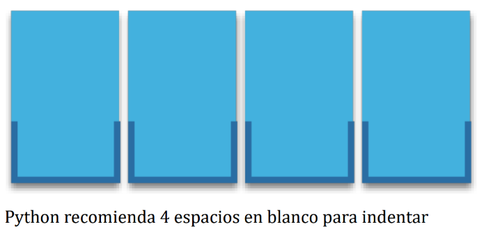

# 🐍 Clase 06 - Condicional if

---

# Condicionales

> A diferencia de otros lenguajes que utilizan llaves para definir los bloques de código, cuando Guido Van Rossum creó el lenguaje quiso evitar estos caracteres por considerarlos innecesarios. Es por ello que en Python los bloques de código se definen a través de espacios en blanco, preferiblemente 4.
En términos técnicos se habla del tamaño de indentación.
> 



```python
def mi_funcion():
    pass

def log():
		pass 
	
```

## La sentencia if

> La sentencia condicional en Python (al igual que en muchos otros lenguajes de programación) es **`if`**. En su escritura debemos añadir una **expresión de comparación** terminando con **dos puntos** al final de la línea. Veamos un ejemplo:
> 

```python
temperatura = float(input('Introduzca la temperatura actual en grados Celsius: '))

print(f'La temperatura actual es de: {temperatura} °C')

if temperatura > 35:
    print('¡Tome precauciones!')
    
print('Fin del Programa')
```

Salida:

```
Introduzca la temperatura actual en grados Celsius: 55
La temperatura actual es de: 55.0 °C
¡Tome precauciones!
Fin del Programa
```

> En el caso anterior se puede ver claramente que la condición se cumple y por tanto se ejecuta la instrucción que tenemos dentro del cuerpo de la condición.
> 

```python
temperatura = float(input('Introduzca la temperatura actual en grados Celsius: '))

print(f'La temperatura actual es de: {temperatura} °C')

if temperatura > 35:
    print('¡Tome precauciones!')
    
print('Fin del Programa')
```

Salida:

```
Introduzca la temperatura actual en grados Celsius: 22
La temperatura actual es de: 22.0 °C
Fin del Programa
```

> En este caso la condición `temperatura > 35` **no se cumple**, por lo que el mensaje de precaución **no aparece**.  Para controlar ese caso existe la sentencia **else**. Veamos el mismo ejemplo anterior, pero añadiendo esta variante:
> 

```python
temperatura = float(input('Introduzca la temperatura actual en grados Celsius: '))

print(f'La temperatura actual es de: {temperatura} °C')

if temperatura > 35:
    print('¡Tome precauciones!')
else:
    print('Parámetros normales, vete al bar')

print('Fin del Programa')
```

Salida:

```
Introduzca la temperatura actual en grados Celsius: 26
La temperatura actual es de: 26.0 °C
Parámetros normales, vete al bar
Fin del Programa
```

> Algunos detalles:
> 
> - La cláusula `else` se ejecuta **únicamente** cuando la condición del `if` es **falsa**.
> - `else` **no lleva condición** después de la palabra else.
> - Igual que el `if`, termina con **dos puntos :** y el bloque que le sigue debe estar **indentado**.
> - El `print('Fin del Programa')` se ejecuta **siempre**, independientemente de si se cumplió o no la condición, porque está fuera del `if-else`.

> Podríamos tener incluso condiciones dentro de condiciones, lo que se viene a llamar técnicamente condiciones anidadas. El anidamiento (o «nesting») hace referencia a incorporar sentencias unas dentro de otras mediante la inclusión de diversos niveles de profundidad (indentación). Veamos un ejemplo ampliando el caso anterior:
> 

```python
temperatura = float(input('Introduzca la temperatura actual en grados Celsius: '))

print(f'La temperatura actual es de: {temperatura} °C')

if temperatura < 20:
    # Rango frío
    if temperatura < 10:
        print('Nivel Azul')       # Muy frío
    else:
        print('Nivel verde')      # Frío moderado
else:
    # Rango no frío (≥ 20 °C)
    if temperatura < 30:
        print('Nivel Naranja, ¡vete al bar!')   # Templado / agradable
    else:
        print('Cuidado: Nivel Rojo')            # Calor / mucho calor

print('Fin del Programa')
```

Salida:

```
Introduzca la temperatura actual en grados Celsius: 31
La temperatura actual es de: 31.0 °C
Cuidado: Nivel Rojo
Fin del Programa
```

### Mejora con `elif`: alternativa a `else` + `if` anidado

Python nos ofrece una mejora en la escritura de condiciones anidadas cuando aparecen consecutivamente un `else` seguido inmediatamente de un `if`. Podemos sustituirlos por la sentencia **`elif`** (abreviatura de *else if*).


> Esto hace que el código sea:
> 
> - Más legible
> - Menos indentado
> - Más fácil de mantener

### Versión con `else` + `if` anidado del ejemplo anterior

```python
if temperatura < 20:
    if temperatura < 10:
        print('Nivel Azul')
    else:
        print('Nivel verde')
else:
    if temperatura < 30:
        print('Nivel Naranja, ¡vete al bar!')
    else:
        print('Cuidado: Nivel Rojo')
```

```python
temperatura = float(input('Introduzca la temperatura actual en grados Celsius: '))

print(f'La temperatura actual es de: {temperatura} °C')

if temperatura < 10:
    print('Nivel Azul')
elif temperatura < 20:
    print('Nivel verde')
elif temperatura < 30:
    print('Nivel Naranja, ¡vete al bar!')
else:
    print('Cuidado: Nivel Rojo')

print('Fin del Programa')
```

Ejemplo de ejecución (temperatura = 31 °C)

```
Introduzca la temperatura actual en grados Celsius: 31
La temperatura actual es de: 31.0 °C
Cuidado: Nivel Rojo
Fin del Programa
```

> Ventajas de usar elif
> 
> - Evita anidamientos innecesarios → menos niveles de indentación
> - El flujo es más lineal y fácil de seguir de arriba hacia abajo
> - Cada condición se evalúa solo si las anteriores fueron falsas
> - El último else (opcional) captura todos los casos que no cumplieron ninguna condición anterior

<aside>
💡

**Regla práctica**:
Siempre que veas un `else`: seguido inmediatamente de un if, considera reemplazarlo por elif (quitando el else y el if anidado).

</aside>

## Asignaciones Condicionales

Supongamos que queremos asignar un nivel de riesgo de incendio en función de la temperatura. En su versión **clásica** escribiríamos:

```python
temperatura = float(input('Introduzca la temperatura actual en grados Celsius: '))

print(f'La temperatura actual es de: {temperatura} °C')

if temperatura < 30:
    riesgo_incendio = 'Riesgo de Incendio: Bajo'
else:
    riesgo_incendio = 'Riesgo de Incendio: ¡Alto!'

print(riesgo_incendio)
```

Ejemplo de ejecución (temperatura alta)

```
Introduzca la temperatura actual en grados Celsius: 46
La temperatura actual es de: 46.0 °C
Riesgo de Incendio: ¡Alto!
```

Sin embargo, esto lo podríamos abreviar con una asignación condicional de una única línea:

```python
temperatura = float(input("Introduzca la temperatura actual: "))

riesgo_incendio = 'Bajo' if temperatura < 30 else 'Alto'

print(riesgo_incendio)
print('Fin del Programa')
```

Ejemplo de ejecución (temperatura baja):

```
Introduzca la temperatura actual: 10
Bajo
Fin del Programa
```

O incluso con f-strings:

```python
temperatura = float(input("Introduzca la temperatura actual: "))
print(f'Riesgo de Incendio: {"Bajo" if temperatura < 30 else "¡Alto!"}')
print('Fin del Programa')
```