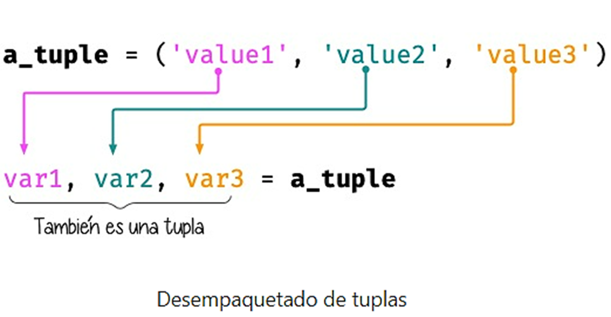
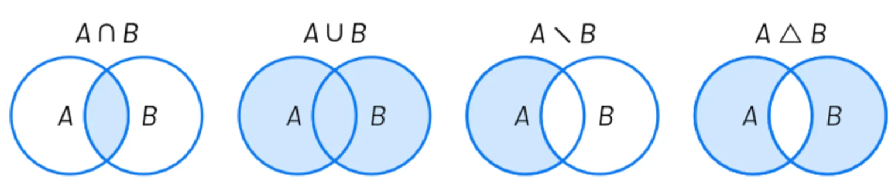
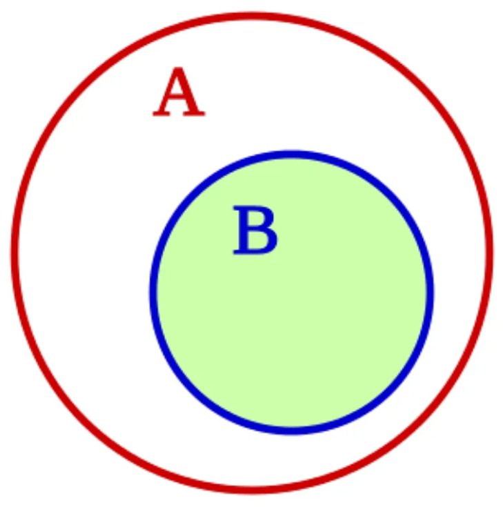

# 🐍 Clase 08 - Tuplas y Conjuntos

---

## 🧱 Tuplas ()

El concepto de **tupla** es muy similar al de *lista*. Aunque hay algunas diferencias menores, lo fundamental es que, mientras una *lista* es mutable y se puede modificar, una *tupla* no admite cambios y por lo tanto, es **inmutable**.

---

Una **tupla** es una estructura de datos ordenada e **inmutable** que puede contener elementos de diferentes tipos. 

**Características principales:**

- Ordenada: mantiene el orden de inserción
- Inmutable: no se puede modificar después de su creación
- Permite elementos duplicados
- Indexable: se puede acceder a elementos por posición
- Es iterable

## ➕ Creando tuplas

```python
empty_tuple = ()

tenerife_geoloc = (28.46824, -16.25462)

three_wise_men = ('Melchor', 'Gaspar', 'Baltasar')
```

---

## ⚠️ Tuplas de un elemento

Hay que prestar especial atención cuando vamos a crear una **tupla de un único elemento**.

La intención primera sería hacerlo de la siguiente manera:

```python
one_item_tuple = ('Papá Noel')
one_item_tuple
type(one_item_tuple)
```

```
'Papá Noel'
str
```

Realmente, hemos creado una variable de tipo `str` (cadena de texto).

Para crear una tupla de un elemento debemos añadir una **coma** al final:

```python
one_item_tuple = ('Papá Noel',)
one_item_tuple
type(one_item_tuple)
```

```
('Papá Noel',)
tuple
```

---

## 🌀 Tuplas sin paréntesis

Según el caso, hay veces que nos podemos encontrar con tuplas que no llevan paréntesis.

Quizás no está tan extendido, pero a efectos prácticos tiene el mismo resultado.

```python
one_item_tuple = 'Papá Noel',

three_wise_men = 'Melchor', 'Gaspar', 'Baltasar'

tenerife_geoloc = 28.46824, -16.25462
```

---

---

### 🟦 Modificar una tupla

Como ya hemos comentado previamente, las tuplas son estructuras de datos **inmutables**. Una vez que las creamos con un valor, no podemos modificarlas. Veamos qué ocurre si lo intentamos:

```python
three_wise_men = 'Melchor', 'Gaspar', 'Baltasar'
three_wise_men[0] = 'Tom Hanks'

```

```
Traceback (most recent call last):
  File "<stdin>", line 1, in <module>
TypeError: 'tuple' object does not support item assignment

```

---

### 🟦 Conversión

Para convertir otros tipos de datos en una tupla podemos usar la función `tuple()`:

```python
shopping = ['Agua', 'Aceite', 'Arroz']
tuple(shopping)
```

```python
('Agua', 'Aceite', 'Arroz')
```

---

Esta conversión es válida para aquellos tipos de datos que sean *iterables*: cadenas de caracteres, listas, diccionarios, conjuntos, etc. Un ejemplo que no funciona es intentar convertir un número en una tupla:

```python
tuple(5)
```

```
Traceback (most recent call last):
  File "<stdin>", line 1, in <module>
TypeError: 'int' object is not iterable
```

---

El uso de la función `tuple()` sin argumentos equivale a crear una tupla vacía:

```python
tuple()
```

```python
()
```

---

### 🟦 Operaciones con tuplas

Con las tuplas podemos realizar todas las operaciones que vimos con listas **salvo las que conlleven una modificación** «in-situ» de la misma, por ejemplo .reverse() no lo podemos usar en tuplas.

### ¿Qué significa "modificación in-situ"?

Una modificación **in-situ** es cuando cambias directamente el objeto original sin crear uno nuevo.

> Sí es posible aplicar funciones built-in tales como sorted() o reversed() sobre una tupla ya que no estamos modificando su valor, sino creando un nuevo objeto.
> 

---

### 🟦 Comparación de Tuplas

La comparación de tuplas funciona exactamente igual que la *comparación de listas*. Las tuplas, al igual que las listas, se pueden trocear (*slicing*) a través de sus *índices*.

---

---

### 🟦 Desempaquetado de tuplas

El **desempaquetado** es una característica de las tuplas que nos permite asignar una tupla a variables independientes:

```python
three_wise_men = 'Melchor', 'Gaspar', 'Baltasar'
a, b, c = three_wise_men

print(a)
print(b)
print(c)
```

```python
Melchor
Gaspar
Baltasar
```

---



---

---

El **desempaquetado** nos permite asignar los valores de una tupla a variables independientes:

```python
valores = (40, 20)
valor1, valor2 = valores
valor1, valor2 = valor2, valor1
valor2
```

Resultado:

```
40
```

---

## 🟦 Desempaquetado extendido

También podemos indicar *grupos* de elementos con el operador `*`:

```python
ranking = ('G', 'A', 'R', 'Y', 'W')
head, *body, tail = ranking

head
body
tail

```

Resultado:

```
'G'
['A', 'R', 'Y']
'W'

```

---

## Casos Más Comunes del Desempaquetado Extendido

### 🎯 **Casos Principales:**

1. **Separar elementos específicos del resto**
    - Primer elemento vs resto: `head, *body = tupla`
    - Último elemento vs resto: `inicio, tail = tupla`
        - Primero y último vs medio: `first, *middle, last = tupla`
2. **Procesar comandos con argumentos variables**
    
    ```python
    comando = ("git", "add", "file1.py", "file2.py", "file3.py")
    programa, *argumentos = comando
    ```
    
    ```python
    programa
    ```
    
    Salida:
    
    ```
    'git'
    ```
    
    ```python
    argumentos
    ```
    
    Salida:
    
    ```
    ['add', 'file1.py', 'file2.py', 'file3.py']
    ```
    
3. **Registros con campos opcionales**
    
    ```python
    estudiante = ("Ana", "García", 20, "Math", "Physics", "Chemistry")
    nombre, apellido, edad, *materias = estudiante
    ```
    
    ```python
    nombre
    ```
    
    Salida:
    
    ```
    'Ana'
    ```
    
    ```python
    materias
    ```
    
    Salida:
    
    ```
    ['Math', 'Physics', 'Chemistry']
    ```
    
4. **Análisis de datos con longitud variable**
    
    ```python
    mediciones = ("Experimento1", 23.5, 24.1, 23.8, 24.2, 23.9)
    nombre, *valores = mediciones
    ```
    
    ```python
    nombre
    ```
    
    Salida:
    
    ```
    'Experimento1'
    ```
    
    ```python
    valores
    ```
    
    Salida:
    
    ```
    [23.5, 24.1, 23.8, 24.2, 23.9]
    ```
    

### 🔧 **Patrones Típicos:**

- **`first, *rest = tupla`** → Procesar el primer elemento especialmente
- **`beginning, last = tupla`** → El último elemento es especial
- **`head, *body, tail = tupla`** → Extremos fijos, centro variable
- **`name, *args = tupla`** → Identificador + argumentos variables

<aside>
💡

El desempaquetado extendido es perfecto cuando tienes **estructura mixta**: algunos  elementos son fijos y predecibles, mientras que otros pueden variar en cantidad. Te permite manejar esta variabilidad de forma elegante sin usar indexing manual o slicing complejo.

</aside>

## 🟦 Desempaquetado genérico

El desempaquetado puede aplicarse a cualquier tipo iterable, como cadenas o listas:

**Cadenas:**

```python
oxygen = 'O2'
first, last = oxygen
first, last
```

Resultado:

```
('O', '2')
```

```python
text = 'Hello, World!'
head, *body, tail = text
head, body, tail
```

Resultado:

```
('H', ['e', 'l', 'l', 'o', ',', ' ', 'W', 'o', 'r', 'l', 'd'], '!')
```

**Listas:**

```python
writer1, writer2, writer3 = ['Virginia Woolf', 'Jane Austen', 'Mary Shelley']
writer1, writer2, writer3
```

Resultado:

```
('Virginia Woolf', 'Jane Austen', 'Mary Shelley')
```

```python
text = 'Hello, World!'
word1, word2 = text.split()
word1, word2
```

Resultado:

```
('Hello,', 'World!')
```

---

---

## 📌 Concatenación de Tuplas

La concatenación de tuplas es el proceso de unir dos o más tuplas. e realiza mediante el uso del operador `+`

```python
Tuple1 = (0, 1, 2, 3)
Tuple2 = ('Geeks', 'For', 'Geeks')

Tuple3 = Tuple1 + Tuple2
Tuple3
```

Salida:

```
(0, 1, 2, 3, 'Geeks', 'For', 'Geeks')
```

Imprimir primera tupla:

```python
# Imprimir primera tupla
print("Tuple 1: ")
print(Tuple1)
```

Salida:

```
Tuple 1: 
(0, 1, 2, 3)
```

Imprimir segunda tupla

```python
# Imprimir segunda tupla
print("\nTuple2: ")
print(Tuple2)
```

Salida:

```
Tuple2: 
('Geeks', 'For', 'Geeks')
```

---

## 📌 Tuplas vs Listas

Aunque puedan parecer estructuras de datos muy similares, sabemos que las tuplas carecen de ciertas operaciones, especialmente las que tienen que ver con la modificación de sus valores, ya que son inmutables.

Si las listas son más flexibles y potentes, ¿por qué íbamos a necesitar tuplas? Veamos 4 potenciales ventajas del uso de tuplas frente a las listas:

1. Las tuplas ocupan **menos espacio** en memoria.
    
    <aside>
    💡
    
    Las **tuplas** son más eficientes en memoria porque:
    
    - **Estructura más simple**: No necesitan espacio extra para gestionar crecimiento
    - **Sin overhead**: Las listas reservan espacio adicional "por si acaso"
    - **Optimización del intérprete**: Python optimiza tuplas pequeñas
    
    Por ejemplo:
    
    ```python
    import sys
    import pickle
    
    tupla = (1, 2, 3, 4, 5)
    lista = [1, 2, 3, 4, 5]
    
    # EN RAM (diferencia significativa)
    print("EN MEMORIA RAM:")
    print(f"Tupla: {sys.getsizeof(tupla)} bytes")
    print(f"Lista: {sys.getsizeof(lista)} bytes")
    
    # EN DISCO (diferencia mínima)
    tupla_serializada = pickle.dumps(tupla)
    lista_serializada = pickle.dumps(lista)
    
    print("\nSI LOS GUARDÁRAMOS EN DISCO:")
    print(f"Tupla serializada: {len(tupla_serializada)} bytes")
    print(f"Lista serializada: {len(lista_serializada)} bytes")
    ```
    
    Salida:
    
    ```
    EN MEMORIA RAM:
    Tupla: 80 bytes
    Lista: 104 bytes
    
    SI LOS GUARDÁRAMOS EN DISCO:
    Tupla serializada: 25 bytes
    Lista serializada: 26 bytes
    ```
    
    En operaciones de lectura las tuplas son más rápidas:
    
    ```python
    import timeit
    
    tupla = (1, 2, 3, 4, 5)
    lista = [1, 2, 3, 4, 5]
    
    # Acceso por índice (1 millón de veces)
    tiempo_tupla = timeit.timeit(lambda: tupla[2], number=1000000)
    tiempo_lista = timeit.timeit(lambda: lista[2], number=1000000)
    
    print(f"Tupla: {tiempo_tupla:.6f} segundos")
    print(f"Lista: {tiempo_lista:.6f} segundos")
    # Las tuplas suelen ser ~5-10% más rápidas
    ```
    
    Salida:
    
    ```
    Tupla: 0.069472 segundos
    Lista: 0.058085 segundos
    ```
    
    </aside>
    
2. En las tuplas existe **protección** frente a cambios indeseados.
    
    <aside>
    💡
    
    Las tuplas **previenen modificaciones accidentales** que podrían introducir bugs sutiles:
    
    Ejemplo peligroso con listas:
    
    ```python
    # Configuración crítica
    config = ["localhost", 5432, "database_prod"]
    
    def procesar_datos(configuracion):
        # ¡ERROR! Modificamos sin querer la config original
        configuracion[0] = "servidor_test"  # ¡BUG!
        # ... resto del código
    
    procesar_datos(config)
    print(config)  # ¡Ya no es la configuración original! 😱
    ```
    
    Solución segura con tuplas:
    
    ```python
    # Configuración protegida
    config = ("localhost", 5432, "database_prod")
    
    def procesar_datos(configuracion):
        #configuracion[0] = "servidor_test"  # ¡ERROR! No se puede
        # TypeError: 'tuple' object does not support item assignment
        pass
    
    # La configuración permanece segura 🔒
    ```
    
    </aside>
    
3. Las tuplas se pueden usar como **claves de diccionarios** (son *hashables*).
4. Las `namedtuples` son una alternativa sencilla a los objetos.
    
    <aside>
    💡
    
    Las **namedtuples** son tuplas con "nombres" para cada campo. Combinan lo mejor de las tuplas (inmutabilidad, eficiencia) con la legibilidad de los objetos.
    
    ```python
    from collections import namedtuple
    
    # ❌ Tupla normal - confusa
    estudiante_tupla = ("Ana", "García", 20, "Ingeniería")
    print(estudiante_tupla[2])  # ¿Qué es 20? ¿Edad? ¿Nota?
    ```
    
    Salida
    
    ```
    20
    ```
    
    Usando NamedTuple:
    
    ```python
    # ✅ Namedtuple - clara
    Estudiante = namedtuple('Estudiante', 'nombre apellido edad carrera')
    estudiante = Estudiante("Ana", "García", 20, "Ingeniería")
    
    print(estudiante.edad)      # ¡Clarísimo que es la edad!
    print(estudiante[2])        # También funciona por índice
    ```
    
    Salida:
    
    ```
    20
    20
    ```
    
    ```python
    estudiante
    ```
    
    Salida:
    
    ```python
    Estudiante(nombre='Ana', apellido='García', edad=20, carrera='Ingeniería')
    ```
    
    </aside>
    

---

### 🎯 **Casos Prácticos**

**Usa tuplas para:**

- Coordenadas GPS (nunca cambian)
- Configuraciones de aplicación
- IDs de empleados, números de documento
- Fechas importantes
- Parámetros de funciones críticas

**Usa listas para:**

- Carritos de compra (se agregan/quitan items)
- Historial de navegación
- Listas de tareas pendientes
- Cualquier colección que deba modificarse

# Conjuntos – `set()`

Un **conjunto** en Python representa una serie de **valores únicos** y **sin orden establecido**, con la única restricción de que sus elementos deben ser *hashables*.

---

> 💡 Nota técnica sobre los sets en Python
> 
> - Al almacenar un elemento en un conjunto (`set`), su valor hash se calcula utilizando una **función de hashing** interna para determinar dónde debe almacenarse en el conjunto. Esta técnica de hashing tiene varias ventajas, especialmente en la eficiencia de búsqueda y almacenamiento de datos.
> - Dado que el valor hash de un elemento siempre será el mismo, sin importar en qué orden insertemos los elementos en un conjunto, estos se almacenan en el mismo orden.

<aside>
💡

**¿Qué es un hash?**

Un **hash** es un valor numérico único generado a partir de un objeto. Python usa la función interna `hash()` para calcularlo. Por ejemplo:

```python
print(hash("Python"))
print(hash(42))
print(hash((1, 2, 3)))  # Las tuplas son inmutables, por eso se pueden hashear
print(hash([1, 2, 3])) # Da error las listas no son 'hashables'. Son mutables
print(hash({'a':1, 'b':2, 'c':3})) # Da error, los diccionarios no son 'hashables'. Son mutables.
```

</aside>

---

---

## Creando conjuntos

Para crear un conjunto basta con separar sus valores por comas y rodearlos de llaves `{}`.

```python
loteria = {21, 10, 46, 29, 31, 94}
loteria
```

```
# Salida:
{10, 21, 29, 31, 46, 94}
```

---

---

## Conjunto vacío

```python
conjunto_vacio = set()
conjunto_vacio
```

```
# Salida:
set()
```

```python
type(conjunto_vacio)
```

```
# Salida:
set

```

---

---

## Conversión

Para convertir otros tipos de datos en un conjunto podemos usar la función `set()` sobre cualquier iterable:

```python
set('aplatanada')
```

```python
# Salida:
{'a', 'd', 'l', 'n', 'p', 't'}
```

```python
set([1, 2, 2, 3, 3, 3, 4, 4, 4, 4, 5, 5, 5, 5, 5])
```

```python
# Salida:
{1, 2, 3, 4, 5}
```

```python
set({'manzana': 'rojo', 'platano': 'amarillo', 'kiwi': 'verde'})
```

```
# Salida:
{'kiwi', 'manzana', 'platano'}
```

---

---

> Importante: Como se ha visto en los ejemplos anteriores, set() se suele utilizar en muchas ocasiones como una forma de extraer los valores únicos de otros tipos de datos. En el caso de los diccionarios se extraen las claves, que, por definición, son únicas.
> 

---

## Operaciones con conjuntos

Detalles aqui:

[set — Python Reference (The Right Way) 0.1 documentation](https://python-reference.readthedocs.io/en/latest/docs/sets/)

### Obtener un elemento

En un conjunto no existe un orden establecido para sus elementos, por lo tanto **no podemos acceder a un elemento en concreto**.

De este hecho se deriva igualmente que **no podemos modificar un elemento existente**, ya que ni siquiera tenemos acceso al mismo. Python sí nos permite añadir o borrar elementos de un conjunto.

---

---

---

> 🔁 Iteración en conjuntos (set)
> 
- Al igual que las cadenas, listas y tuplas, los conjuntos también pueden iterarse utilizando un bucle `for`.

```python
s = {12, 15, 13, 23, 22, 16, 17}
for ele in s:
    print(ele)
```

Salida:

```
16
17
22
23
12
13
15
```

- ⚠️ A diferencia de una cadena, lista o tupla, **no se debe usar un bucle `while`** para acceder a los elementos de un conjunto. Esto se debe a que **no podemos acceder a un elemento de un conjunto usando un índice**, como en `s[i]`.
- La función incorporada `enumerate()` **puede usarse con un conjunto**. La enumeración se realiza según el **orden de acceso**, no el orden de inserción.

---

## Añadir un elemento

Para añadir un elemento a un conjunto debemos utilizar la función `add()`. Como ya hemos indicado, al no importar el orden dentro del conjunto, la inserción no establece a priori la posición donde se realizará.

A modo de ejemplo, vamos a partir de un conjunto que representa a los cuatro integrantes originales de *The Beatles*. Luego añadiremos un nuevo componente:

```python
beatles = set(['Lennon', 'McCartney', 'Harrison', 'Starr'])
beatles.add('Best')  # Pete Best
beatles
```

```
{'Best', 'Harrison', 'Lennon', 'McCartney', 'Starr'}
```

> Truco: Una pequeña regla mnemotécnica para diferenciar add() de append() es que la función append() significa añadir al final, y como los conjuntos no mantienen un orden, esta función se aplica únicamente a listas. Por descarte, la función add() se aplica sobre conjuntos.
> 

---

---

## Borrar elementos

Para borrar un elemento de un conjunto podemos utilizar la función `remove()`. Siguiendo con el ejemplo anterior, vamos a borrar al último «beatle» añadido:

```python
beatles
```

```
{'Best', 'Harrison', 'Lennon', 'McCartney', 'Starr'}
```

```python
beatles.remove('Best')
```

```python
beatles
```

```
{'Harrison', 'Lennon', 'McCartney', 'Starr'}
```

---

---

## Longitud de un conjunto

Podemos conocer el número de elementos (*cardinalidad*) que tiene un conjunto con la función `len()`:

```python
beatles
```

```
{'Harrison', 'Lennon', 'McCartney', 'Starr'}
```

```python
len(beatles)
```

```
4
```

---

---

---

---

## Pertenencia de elemento

Al igual que con otros tipos de datos, Python nos ofrece el operador `in` para determinar si un elemento pertenece a un conjunto:

```python
beatles = {'Harrison', 'Lennon', 'McCartney', 'Starr'}
```

```python
'Lennon' in beatles
# True
```

```python
'Fari' in beatles
# False
```

---

---

## Ordenando un conjunto

Ya hemos comentado que los conjuntos **no mantienen un orden**. ¿Pero qué ocurre si intentamos ordenarlo?

```python
marks = {8, 4, 6, 2, 9, 5}
sorted(marks)
# [2, 4, 5, 6, 8, 9]
```

> Obtenemos una lista con los elementos ordenados.
> 

---

Hay que tener en cuenta que, lógicamente, no podremos hacer uso de la función `sort()` sobre un conjunto:

```python
>>> marks.sort()
Traceback (most recent call last):
  File "<stdin>", line 1, in <module>
AttributeError: 'set' object has no attribute 'sort'
```

---

---

---

> ⚠️ Operaciones no válidas con set
> 
- ❌ Dos conjuntos no se pueden concatenar usando `+`.
- ❌ Dos conjuntos no se pueden fusionar con la forma `z = s + t`.
- ✅ Al convertir una lista a conjunto usando `set()`, **las repeticiones se eliminan**.

```python
lst = [10, 20, 10, 30, 40, 50, 30]
s = set(lst)  # creará el conjunto {10, 20, 30, 40, 50}
```

---

> ⚙️ Uso de funciones incorporadas con set
> 
- Muchas funciones integradas (built-in) se pueden utilizar con conjuntos (`set`):

```python
s = {10, 20, 30, 40, 50}

len(s)      # devuelve el número de elementos en el conjunto
max(s)      # devuelve el valor máximo
min(s)      # devuelve el valor mínimo
sorted(s)   # devuelve una lista ordenada (no un set)
sum(s)      # devuelve la suma de todos los elementos
any(s)      # devuelve True si al menos un elemento es True
all(s)      # devuelve True si todos los elementos son True

```

> ⚠️ Nota: La función reversed() no funciona con conjuntos (set).
> 

---

## Teoría de conjuntos


<aside>
💡

Tenemos dos conjuntos:

- **A** = Personas que toman Café
- **B** = Personas que toman Jugo

Según el diagrama:

- Carla está solo en A
- Pablo está solo en B
- Ana está en la intersección (A ∩ B)

Es decir:

- A = {Carla, Ana}
- B = {Pablo, Ana}

</aside>


<aside>
💡

1️⃣ Unión (A ∪ B)

**Definición teórica:**

La unión contiene todos los elementos que están en A, en B o en ambos.


Cálculo:

A = {Carla, Ana}

B = {Pablo, Ana}

Unión:

A ∪ B = {Carla, Ana, Pablo}

</aside>


<aside>
💡

2️⃣ Intersección (A ∩ B)

**Definición teórica:** Elementos que pertenecen simultáneamente a ambos conjuntos.


Cálculo:

A = {Carla, Ana}

B = {Pablo, Ana}

En el diagrama solo Ana está en ambos.

A ∩ B = {Ana}

</aside>


<aside>
💡

3️⃣ Diferencia (A − B)

**Definición teórica:**
Es el conjunto formado por **todos los elementos que pertenecen a A pero no pertenecen a B**.
Eso corresponde a:


En este caso:

A = {Carla, Ana}

B = {Pablo, Ana}

Quitamos los que también están en B (Ana):

A − B = {Carla}

</aside>


<aside>
💡

4️⃣ Diferencia Simétrica (A Δ B)

**Definición teórica:**

Elementos que están en A o en B, pero NO en ambos.

Formalmente:


Ya sabemos:

A − B = {Carla}
B − A = {Pablo}

Entonces:

A Δ B = {Carla, Pablo}

</aside>



---

Vamos a partir de dos conjuntos `A = {1, 2}` y `B = {2, 3}` para ejemplificar las distintas operaciones que se pueden hacer entre ellos basadas en los **Diagramas de Venn** y la **Teoría de Conjuntos**:

```python
A = {1, 2}
B = {2, 3}
```

---

## Intersección

**A ∩ B** – Elementos que están a la vez en `A` y en `B`:

```python
A = {1, 2}
B = {2, 3}
```

```python
A & B
# Resultado:
{2}
```

```python
A.intersection(B)
# Resultado:
{2}
```

---

---

## Unión

**A ∪ B** – Elementos que están tanto en `A` como en `B`:

```python
A | B
# Resultado:
{1, 2, 3}
```

```python
A.union(B)
# Resultado:
{1, 2, 3}
```

---

---

## Diferencia

**A \ B** – Elementos que están en `A` y no están en `B`:

```python
A - B
# Resultado:
{1}

```

```python
A.difference(B)
# Resultado:
{1}

```

---

---

## Diferencia simétrica

**A △ B** – Elementos que están en `A` o en `B` pero **no** en ambos conjuntos:

```python
A ^ B
# Resultado:
{1, 3}
```

```python
A.symmetric_difference(B)
# Resultado:
{1, 3}
```

---

---

## Inclusión

- Un conjunto `B` es un **subconjunto** de otro conjunto `A` si todos los elementos de `B` están incluidos en `A`.
- Un conjunto `A` es un **superconjunto** de otro conjunto `B` si todos los elementos de `B` están incluidos en `A`.
    
    
    

Veamos un ejemplo con los siguientes conjuntos:

```python
A = {2, 4, 6, 8, 10}
B = {4, 6, 8}
```

En Python podemos realizar comprobaciones de inclusión (subconjuntos y superconjuntos) utilizando operadores clásicos de comparación:

**B ⊂ A**

```python
B < A  # subconjunto
True
```

---

---

### Inclusión

**B ⊆ A**

```python
B <= A
True

```

**A ⊃ B**

```python
A > B  # superconjunto
True

```

**A ⊇ B**

```python
A >= B
True

```

---

---

### Conjuntos por comprensión

Los conjuntos, al igual que las *listas* y los *diccionarios*, también se pueden crear por comprensión.

Veamos un ejemplo en el que construimos un conjunto por comprensión con aquellos números enteros múltiplos de 3 en el rango [0, 20):

```python
m3 = {numero for numero in range(0, 20) if numero % 3 == 0}
m3
```

```python
# Salida
{0, 3, 6, 9, 12, 15, 18}
```

---

---

### Conjuntos inmutables

Python ofrece la posibilidad de crear **conjuntos inmutables** haciendo uso de la función `frozenset()` que recibe cualquier iterable como argumento.

Supongamos que recibimos una serie de calificaciones de exámenes y queremos crear un conjunto inmutable con los posibles niveles (categorías) de calificaciones:

```python
marks = [1, 3, 2, 3, 1, 4, 2, 4, 5, 2, 5, 5, 3, 1, 4]
marks_levels = frozenset(marks)
marks_levels
#Salida:
frozenset({1, 2, 3, 4, 5})

```

---

---

```python
marks_levels.add(50)
Traceback (most recent call last):
  File "<stdin>", line 1, in <module>
AttributeError: 'frozenset' object has no attribute 'add'
```

> 💡 Nota:
> 
> 
> Los `frozenset` son a los `sets` lo que las `tuplas` a las `listas`: una forma de «congelar» los valores para que no se puedan modificar.
> 

---

---

### 🌀 Variedades de conjuntos (set)

- A diferencia de listas y tuplas, **un conjunto no puede contener otro conjunto anidado**.

```python
s = {'gate', 'fate', {10, 20, 30}, 'late'}  # error, conjuntos anidados
```

- ✅ Es posible **desempaquetar** un conjunto usando el operador .

```python
x = {1, 2, 3, 4}
print(*x)  # imprime: 1 2 3 4
```

---