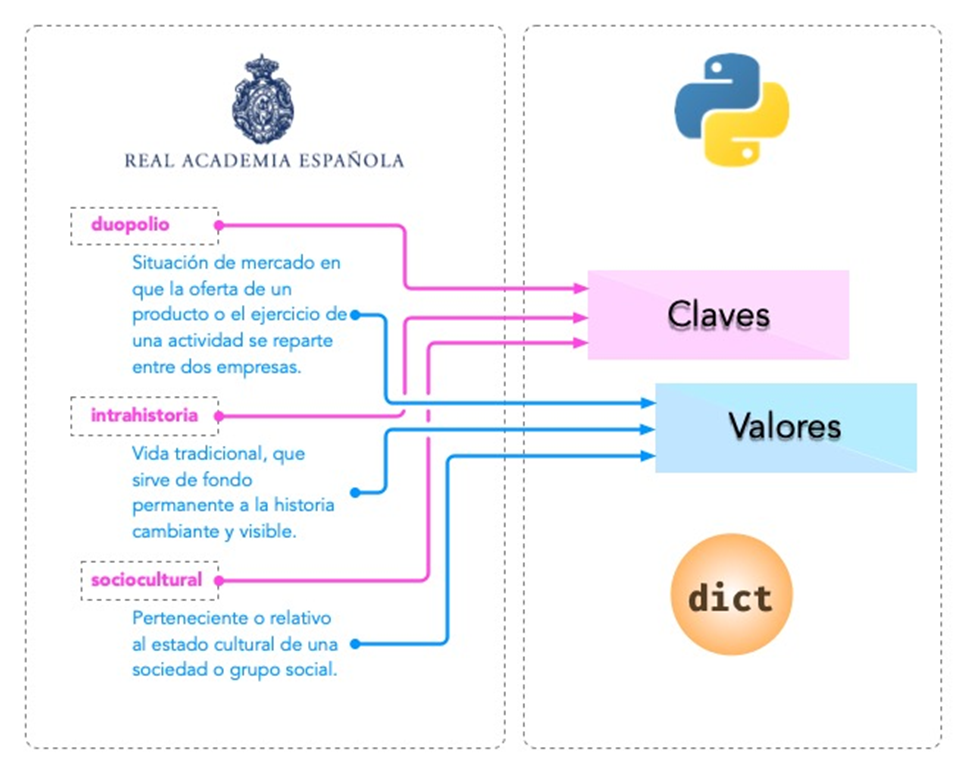

# 🐍 Clase 09 - Diccionarios

## Diccionarios

Podemos trasladar el concepto de diccionario de la vida real al de diccionario en Python. Al fin y al cabo, un diccionario es un objeto que contiene palabras, y cada palabra tiene asociado un significado.

Haciendo el paralelismo, diríamos que en Python un diccionario es también un objeto indexado por **claves** (las palabras) que tienen asociados unos **valores** (los significados).



### Los diccionarios en Python tienen las siguientes características:

- Mantienen el **orden** en el que se insertan las claves.
- Son **mutables**, con lo que admiten añadir, borrar y modificar sus elementos.
- Las **claves** deben ser **únicas**. A menudo se utilizan las *cadenas de texto* como claves, pero en realidad podría ser cualquier tipo de datos inmutable: enteros, flotantes, tuplas (entre otros).
- Tienen un **acceso muy rápido** a sus elementos, debido a la forma en la que están implementados internamente.

### Creando diccionarios

Para crear un diccionario usamos llaves `{}` rodeando asignaciones `clave:valor` que están separadas por comas. Veamos algunos ejemplos de diccionarios:

```python
# Diccionario vacío
diccionario_vacio = {}
diccionario_vacio
# Output: {}
```

```python
rae = {
    'bifronte': 'De dos frentes o dos caras',
    'anarcoide': 'Que tiende al desorden',
    'montuvio': 'Campesino'
}
rae

```

---

**Salida:**

```
{'bifronte': 'De dos frentes o dos caras', 'anarcoide': 'Que tiende al desorden', 'montuvio': 'Campesino' }

```

Aquí tienes la transcripción en formato Markdown para Notion, con texto, código y salida correctamente estructurados:

```python
poblacion_perros = {
    2015: 2_135_209,
    2016: 2_154_924,
    2017: 2_177_048,
    2018: 2_206_901,
    2019: 2_220_270
}

poblacion_perros

```

**Salida**

```python
{2015: 2135209, 2016: 2154924, 2017: 2177048, 2018: 2206901, 2019: 2220270}
```

---

Conversión:

Para convertir otros tipos de datos en un diccionario podemos usar la función `dict()`.

- .Diccionario a partir de una lista de cadenas de texto:

```python
dict(['a1', 'b1'])
```

**Salida**

```python
{'a': '1', 'b': '1'}
```

```python
dict(['12', '45'])
```

**Salida**

```python
{'1': '2', '4': '5'}

```

```python
dict(['a17', 'b18'])
```

**Salida**

```python
ValueError                                Traceback (most recent call last)
<ipython-input-10> in <module>
----> 1 dict(['a17', 'b18'])

ValueError: dictionary update sequence element #0 has length 3; 2 is required

```

- Diccionario a partir de una tupla de cadenas:

```python
dict(('a1', 'b2'))

```

**Salida**

```python
{'a': '1', 'b': '2'}

```

- . Diccionario a partir de una lista de listas:

```python
dict([['a', 1], ['b', 2]])

```

**Salida**

```python
{'a': 1, 'b': 2}

```

> Nota:
> 
> 
> Si nos fijamos bien, cualquier iterable que tenga una estructura interna de 2 elementos es susceptible de convertirse en un diccionario a través de la función `dict()`.
> 

### Diccionario vacío

```python
{}
```

**Salida**

```
{}
```

```python
type({})
```

**Salida**

```
dict
```

```python
dict()
```

**Salida**

```python
{}
```

```python
dict({})

```

**Salida**

```python
{}
```

## Creación con `dict()`

También es posible utilizar la función `dict()` para crear diccionarios y no tener que utilizar llaves y comillas. Supongamos que queremos transformar la siguiente tabla en un diccionario:

| Atributo | Valor |
| --- | --- |
| name | Guido |
| surname | Van Rossum |
| job | Python creator |

Utilizando la construcción mediante `dict()` podemos pasar clave y valor como **argumentos** de la función:

```python
persona = dict(
    name = 'Guido',
    surname = 'Van Rossum',
    job = 'Creador de Python'
)

persona
```

**Salida**

```
{'nombre': 'Guido', 'apellido': 'Van Rossum', 'job': 'Creador de Python'}
```

El inconveniente que tiene esta aproximación es que las **claves deben ser identificadores válidos** en Python. Por ejemplo, no se permiten espacios:

```python
person = dict(
    name = 'Guido Van Rossum',
    date of birth = '31/01/1956'
)
```

**Salida**

```
  File "<stdin>", line 3
    date of birth = '31/01/1956'
         ^
SyntaxError: positional argument follows keyword argument
```

Es posible crear un diccionario especificando sus claves y un único valor de «relleno»:

```python
dict.fromkeys('aeiou', 0)
```

**Salida**

```python
{'a': 0, 'e': 0, 'i': 0, 'o': 0, 'u': 0}

```

> Nota:
> 
> 
> Es válido pasar cualquier «iterable» como referencia a las claves.
> 

```python
dict.fromkeys(('q', 'r', 't', 's', 'u'), 2)
```

**Salida**

```
{'q': 2, 'r': 2, 't': 2, 's': 2, 'u': 2}
```

```python
dict.fromkeys([7, 6, 5, 4, 3], 2)

```

**Salida**

```
{7: 2, 6: 2, 5: 2, 4: 2, 3: 2}
```

---

## Operaciones con diccionarios:

### Obtener un elemento:

Para obtener un elemento de un diccionario basta con escribir la **clave** entre corchetes:

```python
rae = {
    'bifronte': 'De dos frentes o dos caras',
    'anarcoide': 'Que tiende al desorden',
    'montuvio': 'Campesino'
}

rae['anarcoide']
```

**Salida**

```
'Que tiende al desorden'
```

Si intentamos acceder a una clave que no existe, obtendremos un error:

```python
rae['acceso']
```

**Salida**

```
KeyError                                  Traceback (most recent call last)
  File "<stdin>", line 1, in <module>
KeyError: 'acceso'
```

---

## Usando `get()`:

Existe una función muy útil para «superar» los posibles errores de acceso por claves inexistentes.

Se trata de `get()` y su comportamiento es el siguiente:

1. Si la clave que buscamos existe, nos devuelve su valor.
2. Si la clave que buscamos no existe, nos devuelve `None` salvo que le indiquemos otro valor por defecto, pero en ninguno de los dos casos obtendremos un error.

```python
rae = {
    'bifronte': 'De dos frentes o dos caras',
    'anarcoide': 'Que tiende al desorden',
    'montuvio': 'Campesino'
}

rae.get('bifronte')
```

**Salida**

```
'De dos frentes o dos caras'
```

```python
rae.get('programación')
```

**Salida**

```
None
```

```python
rae.get('programacion', 'No disponible')
```

**Salida**

```
'No disponible'
```

---

## Añadir o modificar un elemento

Para añadir un elemento a un diccionario sólo es necesario hacer referencia a la **clave** y asignarle un **valor**:

- Si la clave **ya existía**, se reemplaza el valor existente por el nuevo.
- Si la clave **es nueva**, se añade al diccionario con su valor.*No vamos a obtener un error a diferencia de las listas.*

Partimos del siguiente diccionario para ejemplificar estas acciones:

```python
rae = {
    'bifronte': 'De dos frentes o dos caras',
    'anarcoide': 'Que tiende al desorden',
    'montuvio': 'Campesino'
}
```

Vamos a **añadir** la palabra *enjuiciar* a nuestro diccionario de la Real Academia de La Lengua:

```python
rae['enjuiciar'] = 'Someter una cuestion a examen, discusión y juicio'
```

```python
rae
```

**Salida**

```
{
    'bifronte': 'De dos frentes o dos caras',
    'anarcoide': 'Que tiende al desorden',
    'montuvio': 'Campesino',
    'enjuiciar': 'Someter una cuestion a examen, discusión y juicio'
}
```

---

Supongamos ahora que queremos **modificar** el significado de la palabra *enjuiciar* por otra acepción:

```python
rae['enjuiciar'] = 'Instruir, juzgar o sentenciar una causa'
```

```python
rae
```

**Salida**

```
{
    'bifronte': 'De dos frentes o dos caras',
    'anarcoide': 'Que tiende al desorden',
    'montuvio': 'Campesino',
    'enjuiciar': 'Instruir, juzgar o sentenciar una causa'
}

```

---

## Creando desde vacío:

Una forma muy habitual de trabajar con diccionarios es utilizar el **patrón creación**, partiendo de uno vacío e ir añadiendo elementos poco a poco. Supongamos un ejemplo en el que queremos construir un diccionario donde las claves son las letras vocales y los valores son sus posiciones:

```python
vocales = 'aeiou'
enum_vocales = {}

for i, vocal in enumerate(vocales, start = 1):
    enum_vocales[vocal] = i
```

```python
enum_vocales
```

**Salida**

```
{'a': 1, 'e': 2, 'i': 3, 'o': 4, 'u': 5}
```

## Pertenencia de una clave

La forma *pitónica* de comprobar la existencia de una clave dentro de un diccionario es utilizar el operador `in`:

```python
'bifronte' in rae

```

**Salida**

```
True

```

```python
'almohada' in rae

```

**Salida**

```
False

```

```python
'montuvio' not in rae

```

**Salida**

```
False

```

> Nota: El operador in siempre devuelve un valor booleano, es decir, verdadero o falso.
> 

---

## Obtener todos los elementos

Python ofrece mecanismos para obtener todos los elementos de un diccionario.

Partimos del siguiente diccionario:

```python
rae
```

**Salida**

```
{
  'bifronte': 'De dos frentes o dos caras',
  'anarcoide': 'Que tiende al desorden',
  'montuvio': 'Campesino de la costa',
  'enjuiciar': 'Instruir, juzgar o sentenciar una causa'
}
```

---

### Obtener todas las claves de un diccionario:

Mediante la función `keys()`:

```python
rae.keys()
```

**Salida**

```
dict_keys(['bifronte', 'anarcoide', 'montuvio', 'enjuiciar'])
```

---

### Obtener todos los valores de un diccionario:

Mediante la función `values()`:

```python
rae.values()
```

**Salida**

```
dict_values([
  'De dos frentes o dos caras',
  'Que tiende al desorden',
  'Campesino de la costa',
  'Instruir, juzgar o sentenciar una causa'
])
```

## Obtener todos los pares «clave-valor» de un diccionario

Mediante la función `items()`:

```python
rae.items()
```

**Salida**

```
dict_items([
  ('bifronte', 'De dos frentes o dos caras'),
  ('anarcoide', 'Que tiende al desorden'),
  ('montuvio', 'Campesino de la costa'),
  ('enjuiciar', 'Instruir, juzgar o sentenciar una causa')
])
```

> Nota: Para este último caso cabe destacar que los items se devuelven como una lista de tuplas, donde cada tupla tiene dos elementos: el primero representa la clave y el segundo representa el valor.
> 

---

## Longitud de un diccionario

Podemos conocer el número de elementos («clave-valor») que tiene un diccionario con la función `len()`:

```python
rae

```

**Salida**

```
{
  'bifronte': 'De dos frentes o dos caras',
  'anarcoide': 'Que tiende al desorden',
  'montuvio': 'Campesino de la costa',
  'enjuiciar': 'Instruir, juzgar o sentenciar una causa'
}
```

```python
len(rae)
```

**Salida**

```
4
```

## Iterar sobre un diccionario

En base a *los elementos que podemos obtener*, Python nos proporciona tres maneras de iterar sobre un diccionario.

### Iterar sobre claves:

```python
for word in rae.keys():
    print(word)
```

**Salida**

```
bifronte
anarcoide
montuvio
enjuiciar
```

---

### Iterar sobre valores:

```python
for meaning in rae.values():
    print(meaning)
```

**Salida**

```
De dos frentes o dos caras
Que tiende al desorden
Campesino de la costa
Instruir, juzgar o sentenciar una causa
```

---

### Iterar sobre «clave-valor»:

```python
for word, meaning in rae.items():
    print(f'{word}: {meaning}')
```

**Salida**

```
bifronte: De dos frentes o dos caras
anarcoide: Que tiende al desorden
montuvio: Campesino de la costa
enjuiciar: Instruir, juzgar o sentenciar una causa
```

## Combinar diccionarios

Dados dos (o más) diccionarios, es posible «mezclarlos» para obtener una combinación de los mismos. Esta combinación se basa en dos premisas:

1. Si la clave no existe, se añade con su valor.
2. Si la clave ya existe, se añade con el valor del **último** diccionario en la mezcla.

Python ofrece dos mecanismos para realizar esta combinación.

Vamos a partir de los siguientes diccionarios para ejemplificar su uso:

```python
rae1 = {
    'bifronte': 'De dos frentes o dos caras',
    'enjuiciar': 'Someter una cuestion a examen, discusión y juicio'
}

rae2 = {
    'anarcoide': 'Que tiende al desorden',
    'montuvio': 'Campesino de la costa',
    'enjuiciar': 'Instruir, juzgar o sentenciar una causa'
}
```

---

### Sin modificar los diccionarios originales:

Mediante el operador `**`:

```python
{**rae1, **rae2}
```

**Salida**

```
{
  'bifronte': 'De dos frentes o dos caras',
  'enjuiciar': 'Instruir, juzgar o sentenciar una causa',
  'anarcoide': 'Que tiende al desorden',
  'montuvio': 'Campesino de la costa'
}
```

---

### A partir de Python 3.9 Podemos utilizar el operador `|` para combinar dos diccionarios:

```python
rae1 | rae2
```

**Salida**

```
{
  'bifronte': 'De dos frentes o dos caras',
  'enjuiciar': 'Instruir, juzgar o sentenciar una causa',
  'anarcoide': 'Que tiende al desorden',
  'montuvio': 'Campesino de la costa'
}
```

---

### Modificando los diccionarios originales:

Mediante la función `update()`:

```python
rae1.update(rae2)
```

```python
rae1
```

**Salida**

```
{
  'bifronte': 'De dos frentes o dos caras',
  'enjuiciar': 'Instruir, juzgar o sentenciar una causa',
  'anarcoide': 'Que tiende al desorden',
  'montuvio': 'Campesino de la costa'
}

```

## Borrar elementos

Python nos ofrece, al menos, tres formas para borrar elementos en un diccionario:

### Por su clave:

Mediante la sentencia `del`:

```python
rae = {
    'bifronte': 'De dos frentes o dos caras',
    'anarcoide': 'Que tiende al desorden',
    'montuvio': 'Campesino'
}

del rae['bifronte']
rae

```

**Salida**

```
{'anarcoide': 'Que tiende al desorden', 'montuvio': 'Campesino'}

```

---

### Por su clave (con extracción):

Mediante la función `pop()` podemos extraer un elemento del diccionario por su clave.

Vendría a ser una combinación de `get()` + `del`:

```python
rae = {
    'bifronte': 'De dos frentes o dos caras',
    'anarcoide': 'Que tiende al desorden',
    'montuvio': 'Campesino'
}

rae.pop('anarcoide')

```

**Salida**

```
'Que tiende al desorden'
```

```python
rae
```

**Salida**

```
{'bifronte': 'De dos frentes o dos caras', 'montuvio': 'Campesino'}
```

---

### Acceso con `pop()` a una clave inexistente:

```python
rae.pop('bucle')
```

**Salida**

```
KeyError                                  Traceback (most recent call last)
  File "<stdin>", line 1, in <module>
KeyError: 'bucle'
```

## Borrado completo del diccionario

### 1. Utilizando la función `clear()`:

```python
rae = {
    'bifronte': 'De dos frentes o dos caras',
    'anarcoide': 'Que tiende al desorden',
    'montuvio': 'Campesino'
}
rae.clear()
```

```
rae
```

**Salida**

```
{}
```

---

### 2. «Reinicializando» el diccionario a vacío con `{}`:

```python
rae = {
    'bifronte': 'De dos frentes o dos caras',
    'anarcoide': 'Que tiende al desorden',
    'montuvio': 'Campesino'
}
rae = {}
```

```
rae
```

**Salida**

```
{}
```

---

## Cuidado con las copias

Al igual que ocurre con las *listas*, si hacemos un cambio en un diccionario, se verá reflejado en todas las variables que hagan referencia al mismo. Esto se debe a su propiedad de ser *mutable*.

```python
original_rae = {
    'bifronte': 'De dos frentes o dos caras',
    'anarcoide': 'Que tiende al desorden',
    'montuvio': 'Campesino de la costa'
}

copy_rae = original_rae
original_rae['bifronte'] = 'bla bla bla'
```

```
original_rae
```

**Salida**

```
{'bifronte': 'bla bla bla',
 'anarcoide': 'Que tiende al desorden',
 'montuvio': 'Campesino de la costa'}
```

```
copy_rae
```

**Salida**

```
{'bifronte': 'bla bla bla',
 'anarcoide': 'Que tiende al desorden',
 'montuvio': 'Campesino de la costa'}
```

---

## Solución: copia con `copy()`

Una posible solución es hacer una «copia dura». Python proporciona la función `copy()` para estos casos:

```python
original_rae = {
    'bifronte': 'De dos frentes o dos caras',
    'anarcoide': 'Que tiende al desorden',
    'montuvio': 'Campesino de la costa'
}

copy_rae = original_rae.copy()
original_rae['bifronte'] = 'bla bla bla'
```

```
original_rae
```

**Salida**

```
{'bifronte': 'bla bla bla',
 'anarcoide': 'Que tiende al desorden',
 'montuvio': 'Campesino de la costa'}

```

```
copy_rae
```

**Salida**

```
{'bifronte': 'De dos frentes o dos caras',
 'anarcoide': 'Que tiende al desorden',
 'montuvio': 'Campesino de la costa'}
```

---

## 🧠 Diccionarios por comprensión

Veamos un ejemplo en el que creamos un **diccionario por comprensión** donde las claves son palabras y los valores son sus longitudes:

```python
palabras = ('Sol', 'Espacio', 'Cohete', 'Tierra')
long_palabras = {palabra: len(palabra) for palabra in palabras}
long_palabras
```

```
{'Sol': 3, 'Espacio': 7, 'Cohete': 6, 'Tierra': 6}
```

---

También podemos aplicar **condiciones** a estas comprensiones. Continuando con el ejemplo anterior, podemos incorporar la restricción de **sólo incluir palabras que no empiecen por vocal**:

```python
palabras = ('sol', 'espacio', 'cohete', 'tierra')
long_palabras = {p: len(p) for p in palabras if p[0] not in 'aeiou'}
long_palabras
```

```
{'sol': 3, 'cohete': 6, 'tierra': 6}
```

---

## 🔒 Objetos «hashables»

La única restricción que deben cumplir las **claves de un diccionario** es ser *hashables*. Un objeto es *hashable* si se le puede asignar un valor **hash** que no cambia durante toda su vida.

Para encontrar el *hash* de un objeto, Python usa la función `hash()`, que devuelve un número entero y es utilizado para indexar la **tabla hash** que se mantiene internamente:

```python
hash(999)
```

```
999
```

```python
hash(3.14)
```

```
322818021289917443
```

```python
hash('hello')
```

```
-8103770210014465245
```

```python
hash(('a', 'b', 'c'))
```

```
-2157188727417140402
```

---

Para que un objeto sea *hashable*, debe ser **inmutable**:

```python
hash(['a', 'b', 'c'])
```

```
Traceback (most recent call last):
  File "<stdin>", line 1, in <module>
TypeError: unhashable type: 'list'
```

> 💡 Nota: De lo anterior se deduce que las claves de los diccionarios, al tener que ser hashables, sólo pueden ser objetos inmutables.
> 

---